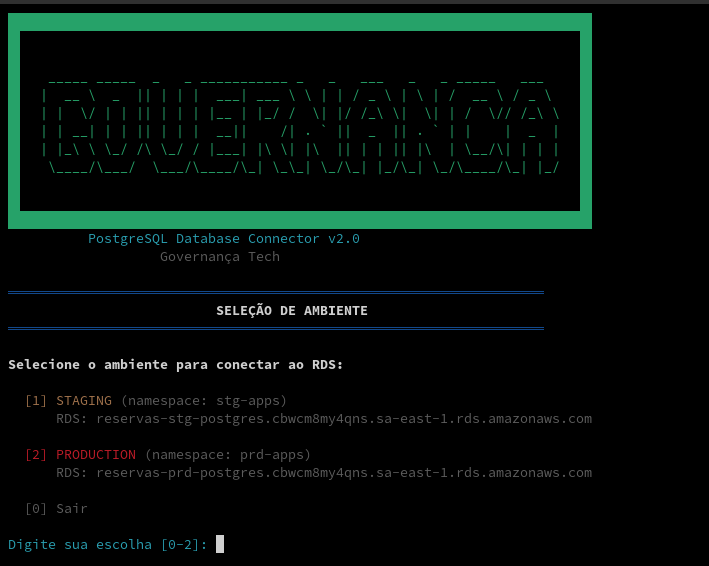

# RDS Connector v2.0


> Conector multiplataforma para conexão segura ao RDS PostgreSQL via Kubernetes. Interface intuitiva com menus interativos e gerenciamento automático de recursos.

## 📥 Download

Baixe o executável para sua plataforma:

- **Linux**: [rds-connector-linux-amd64-v2.0.tar.gz](https://github.com/seazone/rds-connector/releases/latest/download/rds-connector-linux-amd64-v2.0.tar.gz)
- **Windows**: [rds-connector-windows-amd64-v2.0.zip](https://github.com/seazone/rds-connector/releases/latest/download/rds-connector-windows-amd64-v2.0.zip)
- **macOS Intel**: [rds-connector-macos-amd64-v2.0.tar.gz](https://github.com/seazone/rds-connector/releases/latest/download/rds-connector-macos-amd64-v2.0.tar.gz)
- **macOS Apple Silicon**: [rds-connector-macos-arm64-v2.0.tar.gz](https://github.com/seazone/rds-connector/releases/latest/download/rds-connector-macos-arm64-v2.0.tar.gz)

## 🖼️ Screenshot



## Uso Rápido

### Linux/macOS
```bash
# Torne executável
chmod +x rds-connector-linux-amd64

# Execute
./rds-connector-linux-amd64
```

### Windows
```cmd
# Execute duplo-clique ou via terminal
rds-connector-windows-amd64.exe
```

## Pré-requisitos

### Ferramentas Essenciais

- **kubectl** instalado e configurado
- **AWS CLI** configurado com credenciais
- **Acesso ao cluster EKS** via credenciais AWS
- **Permissões** para criar pods no namespace selecionado

### Instalação do kubectl

#### Linux
```bash
curl -LO "https://dl.k8s.io/release/$(curl -L -s https://dl.k8s.io/release/stable.txt)/bin/linux/amd64/kubectl"
chmod +x kubectl
sudo mv kubectl /usr/local/bin/
```

#### macOS
```bash
brew install kubectl
```

#### Windows
```bash
choco install kubernetes-cli
# Ou baixar diretamente do site oficial
```

### Configuração AWS

```bash
# Configurar credenciais
aws configure

# Ou usar SSO
aws sso login

# Atualizar kubeconfig
aws eks update-kubeconfig --region sa-east-1 --name general-cluster
```

## Compilação

### Pré-requisitos
- Go 1.21+
- Make (opcional)

### Compilar para todas as plataformas
```bash
make build-all
```

### Compilar para plataforma específica
```bash
# Linux
make build-linux

# Windows  
make build-windows

# macOS
make build-macos

# Plataforma atual
make build
```

### Criar pacotes de release
```bash
make package
```

## Configuração

### Ambientes Disponíveis

| Ambiente | Namespace | RDS Host |
|----------|-----------|----------|
| STAGING | stg-apps | reservas-stg-postgres.cbwcm8my4qns.sa-east-1.rds.amazonaws.com |
| PRODUCTION | prd-apps | reservas-prd-postgres.cbwcm8my4qns.sa-east-1.rds.amazonaws.com |

## Troubleshooting

### Problemas Comuns

#### kubectl não encontrado
```
kubectl não encontrado. Instale o kubectl e tente novamente.
```
**Solução**: Instale o kubectl para sua plataforma (veja seção Pré-requisitos)

#### Cluster inacessível
```
Não foi possível conectar ao cluster Kubernetes. Verifique suas credenciais.
```
**Solução**: Configure AWS CLI e kubeconfig
```bash
aws sts get-caller-identity
aws eks update-kubeconfig --region sa-east-1 --name general-cluster
```

#### Namespace não existe
```
Namespace 'prd-apps' não encontrado no cluster.
```
**Solução**: Verifique se o namespace existe no cluster
```bash
kubectl get namespaces
```

#### Pod não fica pronto
```
Pod não ficou pronto dentro do tempo limite (60s).
```
**Solução**: Verifique recursos do cluster e tolerations
```bash
kubectl top nodes
kubectl get pods -A | grep Pending
```

#### RDS inacessível
```
Não foi possível conectar ao RDS. Verifique security groups.
```
**Solução**: Verifique security groups e regras de rede

### Logs Detalhados

Em caso de erro, o aplicativo mostra:
- **Mensagem específica** do problema
- **Logs do pod** Kubernetes  
- **Status detalhado** do pod
- **Sugestões** de solução

## Estrutura do Projeto

```
rds-connector-go/
├── main.go           # Código principal
├── go.mod           # Dependências Go
├── Makefile         # Build automation
├── README.md        # Documentação
└── build/           # Executáveis compilados
    ├── rds-connector-linux-amd64
    ├── rds-connector-windows-amd64.exe
    ├── rds-connector-macos-amd64
    └── ...
```

## Desenvolvimento

### Executar em modo desenvolvimento
```bash
go run .
```

### Executar com build local
```bash
make dev
./build/rds-connector-dev
```

### Testes
```bash
make test
```

## Distribuição

### Para desenvolvedores

1. **Download** do executável apropriado
2. **Executar** diretamente (Linux/macOS precisam `chmod +x`)
3. **Seguir** menu interativo

### Vantagens do executável

- ✅ **Sem instalação** de dependências
- ✅ **Funciona offline** (exceto kubectl)
- ✅ **Interface consistente** em todas as plataformas
- ✅ **Atualização simples** (trocar arquivo)

## Versões

- **v2.0** - Versão Go multiplataforma
- **v1.0** - Script Bash original

## Contribuindo

Para contribuir com o projeto:

1. Faça um fork do repositório
2. Crie um branch: `git checkout -b feature/nova-funcionalidade`
3. Faça suas alterações e confirme: `git commit -m 'Adiciona nova funcionalidade'`
4. Envie para o branch: `git push origin feature/nova-funcionalidade`
5. Crie uma Pull Request

## Colaboradores

<table>
  <tr>
    <td align="center">
      <a href="https://github.com/johnpaulo0602" title="John Paulo Paiva">
        <br>
        <sub>
          <b>John Paulo Paiva</b>
        </sub>
      </a>
    </td>
  </tr>
</table>
